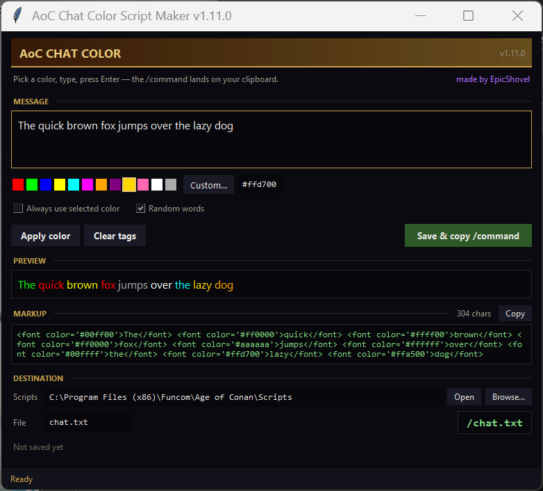

# AoC Chat Color Script Maker

Small Windows desktop helper for writing **colored chat messages in Age of Conan** — without memorizing the game's `` markup.

Created By **EpicShovel**

Pick a color, type your message, press **Enter** — the app writes the markup into Age of Conan's Scripts folder and copies the `/command` to your clipboard. In game: click the chat box, **Ctrl+V, Enter** — colored text in your current channel.

## Features

- 12 preset colors, plus any custom color via the color dialog or by typing a hex value.
- **Live preview** showing exactly what the game will render — including a warning when your message contains `<` or `>` that AoC will try to read as a tag.
- **Apply color** to the highlighted text (or the whole message); **Clear tags** strips all markup again.
- Auto-color mode: everything you type is sent in the selected color — and any text you colored by hand keeps its own color.
- **Random-words mode**: every word gets a random palette color as you type. Neighboring words never match, and the draw skips colors that are unreadable against AoC's dark chat window.
- Saves single-quoted markup (the way AoC parses it) into the game's **Scripts** folder — auto-detected, or pick it with the built-in folder browser.
- The file name **is** the in-game command: `chat.txt` runs as `/chat.txt` in game chat.
- Copies the `/chat.txt` command to your **clipboard** on save; a separate **Copy** button grabs the raw markup.
- Writes the file as **Windows-1252**, which is how the game reads it back — so an em dash or curly quote pasted in from Discord shows up correctly instead of as garbled characters.
- Character counter with a warning for very long messages.
- Remembers your Scripts folder, file name, selected color and mode between runs.
- Dark Hyborian-style UI with tooltips, always-on-top window, DPI-aware layout.
- Fully offline, no dependencies; settings in `%APPDATA%\AoC Chat Color Script Maker`.

## Screenshots

## Install

1. Download `AoC_Chat_Color_Paster_Setup_1.11.0.exe` from the [Releases](https://github.com/EpicShovel/aoc-chat-color-paster/releases) page and run it.
   Prefer no installer? The `.zip` on the same page unzips anywhere — just keep the `_internal` folder next to the exe.
2. Pick a color, type, press Enter — then Ctrl+V in game chat.

## A note on SmartScreen and antivirus

The app is built with PyInstaller and signed with a **self-issued** certificate — there is no paid code-signing certificate behind this, so Windows will not recognize the publisher.

- Windows may show a SmartScreen "unknown publisher" prompt on first run. **More info > Run anyway** clears it, and costs one click.
- The certificate's publisher name shows as **Requiem Nex** (that is the certificate identity; EpicShovel is the product publisher). The **app exe** is signed with it; from 1.11.0 on the **installer is signed too** — 1.10.0's installer went out unsigned.
- Because the signature is self-issued, some antivirus engines may still report a generic false positive on a PyInstaller-packed exe.
- `READ_ME_FIRST.txt` ships with the installer and explains exactly what the optional `Trust-RequiemNex.bat` does before you run it — it adds the certificate to *your* Windows user's trust stores only, needs no admin, and cannot be revoked once trusted. Running it is optional; the one-click SmartScreen route is the zero-trust alternative.

## License

All rights reserved — EpicShovel.

Unofficial fan project. Age of Conan is a trademark of Funcom.
