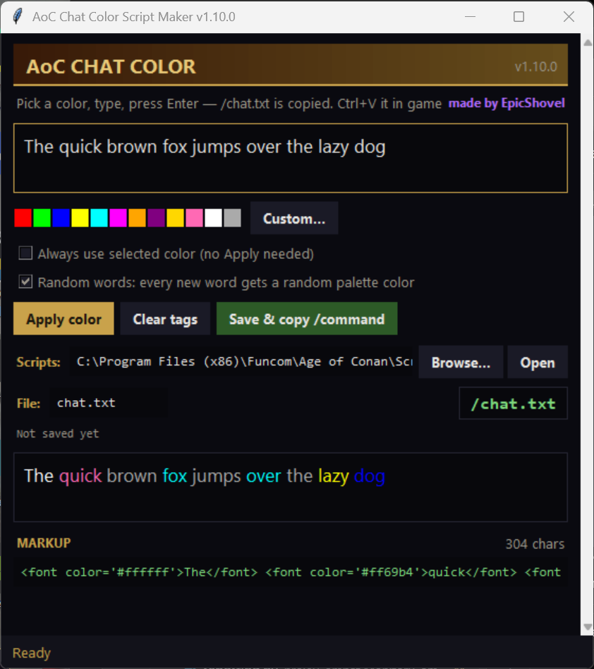

# AoC Chat Color Script Maker

Small Windows desktop helper for writing **colored chat messages in Age of Conan** — without memorizing the game's `` markup.

Created By **EpicShovel**

Pick a color, type your message, press **Enter** — the app writes the markup into Age of Conan's Scripts folder and copies the `/command` to your clipboard. In game: click the chat box, **Ctrl+V, Enter** — colored text in your current channel.

## Features

- 12 preset colors + any custom color via the color dialog.
- **Live preview** of your message in the selected color.
- **Apply color** to the highlighted text (or the whole message); **Clear tags** strips all markup again.
- Auto-color mode: everything you type is sent in the selected color automatically.
- **Random-words mode** (new in 1.10.0): every new word automatically gets a random quick-palette color as you type — no Apply needed; the preview shows each word in its own color.
- Saves single-quoted markup (the way AoC parses it) into the game's **Scripts** folder — auto-detected, or pick it with Browse.
- The file name **is** the in-game command: `chat.txt` runs as `/chat.txt` in game chat.
- Copies the `/chat.txt` command to your **clipboard** on save.
- Character counter with a warning for very long messages.
- Remembers your Scripts folder, file name and color settings between runs.
- Dark Hyborian-style UI with tooltips, always-on-top window.
- Fully offline, no dependencies; settings in `%APPDATA%\AoC Chat Color Script Maker`.

## Screenshots

## Install

1. Download `AoC_Chat_Color_Paster_Setup_1.10.0.exe` from this repository (or from [Releases](https://github.com/EpicShovel/aoc-chat-color-paster/releases)).
2. Run the installer.
3. Pick a color, type, press Enter — then Ctrl+V in game chat.

## License

All rights reserved — EpicShovel.
